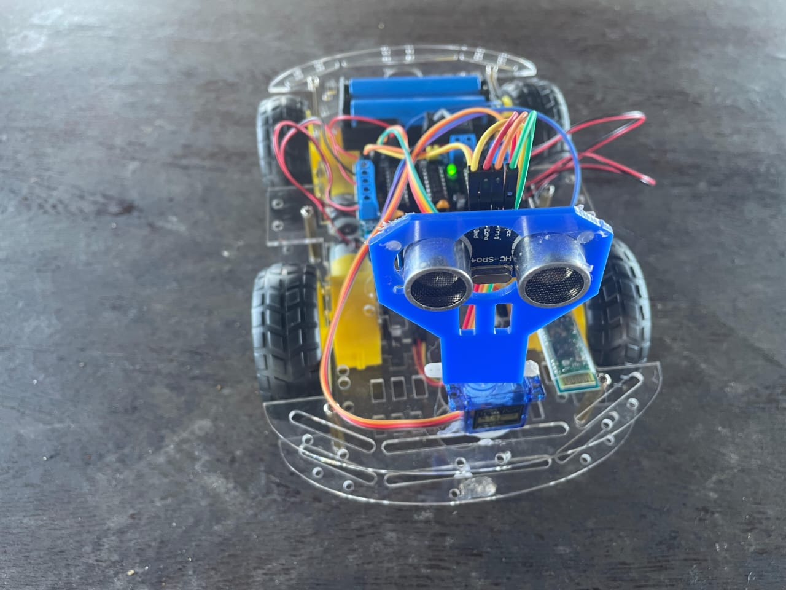
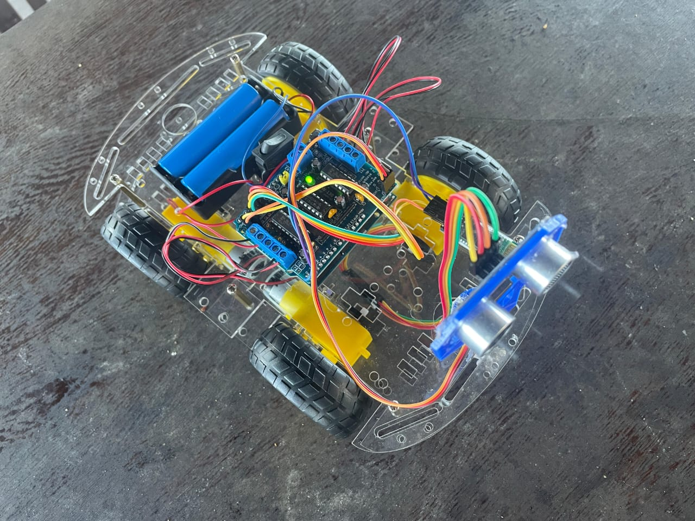
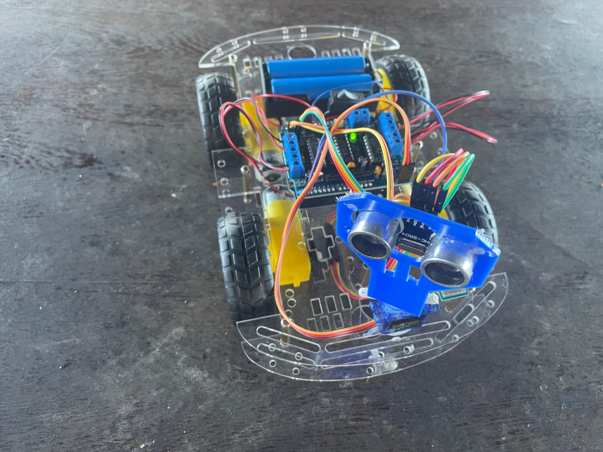
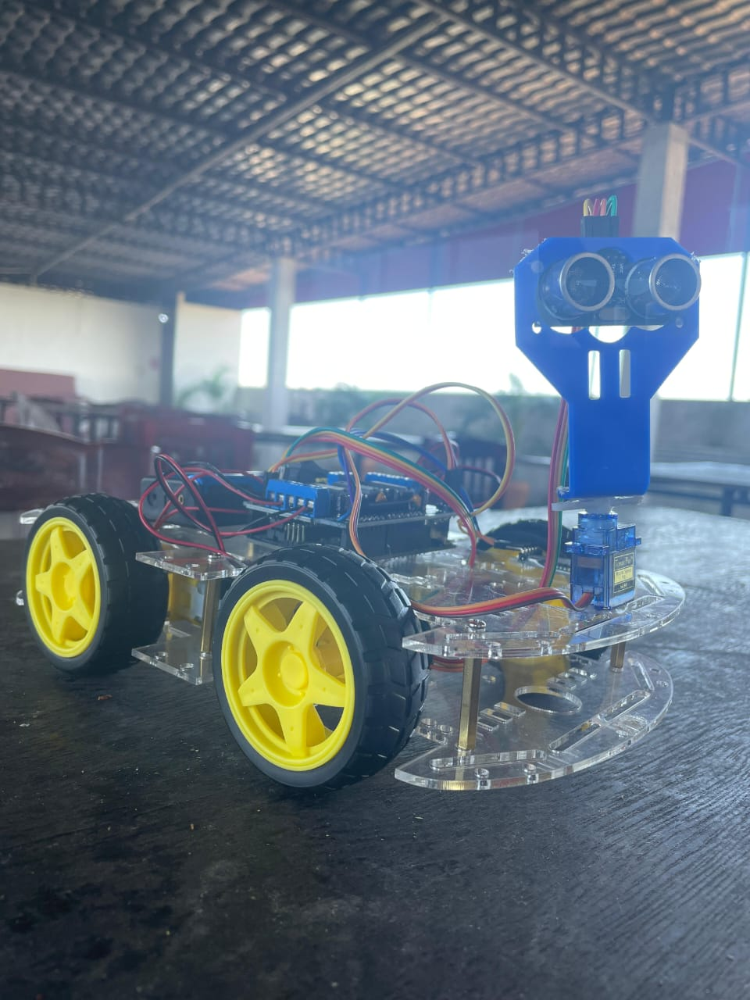
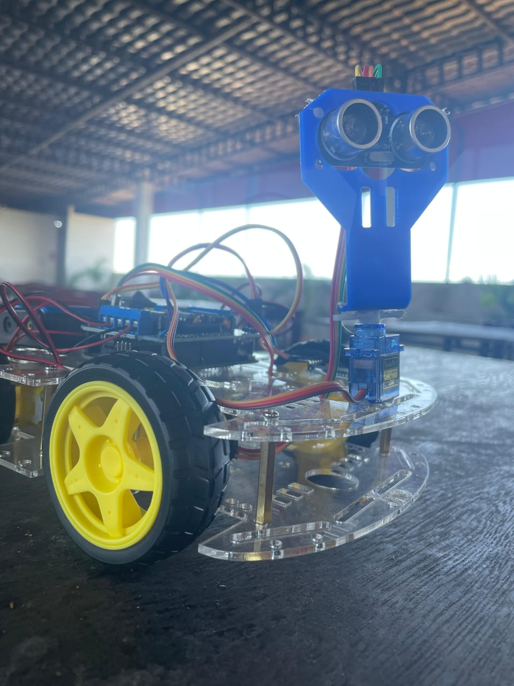
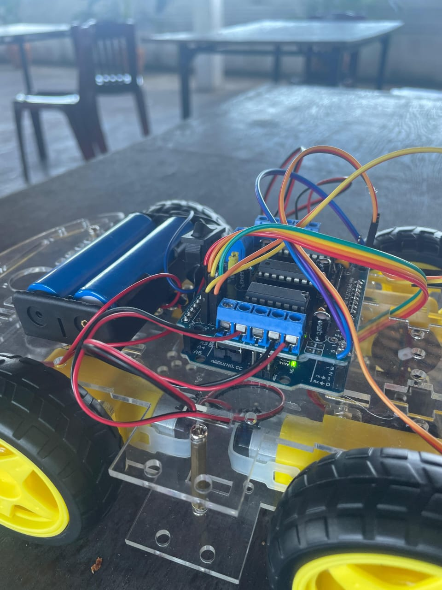

# Arduino Robot Car - Multi-Control System

A versatile Arduino-based robot car featuring obstacle avoidance, Bluetooth control, and voice control capabilities.

## 📸 Photos








*Various views of the Arduino robot car showing its components and design*

## 🤖 Features

- **Obstacle Avoidance**: Autonomous navigation using ultrasonic sensor
- **Bluetooth Control**: Remote control via smartphone or computer
- **Voice Control**: Voice command recognition and execution
- **180° Scanning**: Servo-mounted ultrasonic sensor for environment mapping (20° to 180°)
- **4-Wheel Drive**: Independent motor control for precise movement

## 🔧 Hardware Components

### Main Components
- Arduino Uno/Nano microcontroller
- Adafruit Motor Shield v1 (AFMotor)
- 4x DC Motors with wheels
- HC-SR04 Ultrasonic Distance Sensor
- SG90 Servo Motor
- Bluetooth Module (HC-05/HC-06)
- Voice Recognition Module

### Connections
- **Ultrasonic Sensor**: Echo → A0, Trigger → A1
- **Servo Motor**: Signal → Pin 10
- **Motors**: Connected via Motor Shield (M1, M2, M3, M4)
- **Bluetooth**: TX/RX pins for serial communication

## ⚙️ Technical Specifications

- **Operating Voltage**: 5V-12V
- **Motor Speed**: 170 (configurable)
- **Detection Range**: 2cm - 400cm
- **Servo Range**: 20° - 180° (scanning range)
- **Communication**: Serial (9600 baud rate)
- **Obstacle Detection Distance**: 12cm threshold
- **Voice Control Safety Distance**: 10cm threshold

## 🎮 Control Methods

### 1. Bluetooth Control
Use a smartphone app or computer to send commands:
- `F` - Forward
- `B` - Backward
- `L` - Left
- `R` - Right
- `S` - Stop

### 2. Voice Control
Voice commands are converted to control signals:
- `^` - Move Forward
- `-` - Move Backward
- `<` - Turn Left (with obstacle check)
- `>` - Turn Right (with obstacle check)
- `*` - Stop

### 3. Autonomous Mode
The robot automatically:
- Scans environment with servo-mounted sensor
- Avoids obstacles by turning toward clearer path
- Maintains safe distance (>12cm) from objects

## 🚀 Getting Started

### Prerequisites
1. Arduino IDE installed
2. Required libraries:
   - Servo.h (built-in)
   - AFMotor.h (Adafruit Motor Shield Library)

### Installation
1. Clone this repository
2. Install the AFMotor library in Arduino IDE
3. Upload `code.ino` to your Arduino board
4. Connect all components according to the wiring diagram

### Usage
1. Power on the robot
2. Uncomment desired control method in the `loop()` function:
   ```cpp
   void loop() {
     Obstacle();        // For autonomous mode
     //Bluetoothcontrol(); // For Bluetooth control
     //voicecontrol();     // For voice control
   }
   ```
3. Upload the modified code and enjoy!

## 🔄 Operating Modes

The robot can operate in three modes (uncomment the desired mode in the main loop):

1. **Autonomous Obstacle Avoidance** (`Obstacle()`)
2. **Bluetooth Remote Control** (`Bluetoothcontrol()`)
3. **Voice Command Control** (`voicecontrol()`)

## 🛠️ Customization

### Adjustable Parameters
- `Speed`: Motor speed (0-255)
- `spoint`: Servo center position (103°)
- Detection threshold: Currently set to 12cm
- Turn delays: Adjust timing for different chassis

### Adding Features
The modular code structure makes it easy to add:
- LED indicators
- Camera module
- Additional sensors
- Custom movement patterns

## 📡 Communication Protocol

### Bluetooth Commands
| Command | Action | Description |
|---------|--------|-------------|
| F | Forward | Move forward at set speed |
| B | Backward | Move backward at set speed |
| L | Left | Turn left (tank steering) |
| R | Right | Turn right (tank steering) |
| S | Stop | Stop all motors |

### Voice Commands
| Signal | Action | Description |
|--------|--------|-------------|
| ^ | Forward | Move forward |
| - | Backward | Move backward |
| < | Smart Left | Turn left with obstacle check |
| > | Smart Right | Turn right with obstacle check |
| * | Stop | Emergency stop |

## 🔍 Troubleshooting

### Common Issues
1. **Robot not moving**: Check motor connections and power supply
2. **Erratic obstacle avoidance**: Verify ultrasonic sensor wiring
3. **Bluetooth not responding**: Ensure correct baud rate (9600)
4. **Servo not scanning**: Check servo connection to pin 10

### Calibration
- Adjust `spoint` value for proper servo center position
- Modify speed settings based on your motors and chassis weight
- Fine-tune obstacle detection distance for your environment

## 📋 Future Enhancements

- [ ] Mobile app for enhanced control
- [ ] Camera streaming capability
- [ ] Line following mode
- [ ] GPS navigation
- [ ] Multi-robot coordination
- [ ] Web interface control

## 🤝 Contributing

Feel free to contribute to this project by:
- Adding new control methods
- Improving obstacle avoidance algorithms
- Creating mobile applications
- Enhancing documentation

## 📄 License

This project is open source and available under the [MIT License](LICENSE).

## 📞 Contact

For questions or suggestions, please open an issue in this repository.

---

*Built with ❤️ using Arduino and passion for robotics*
